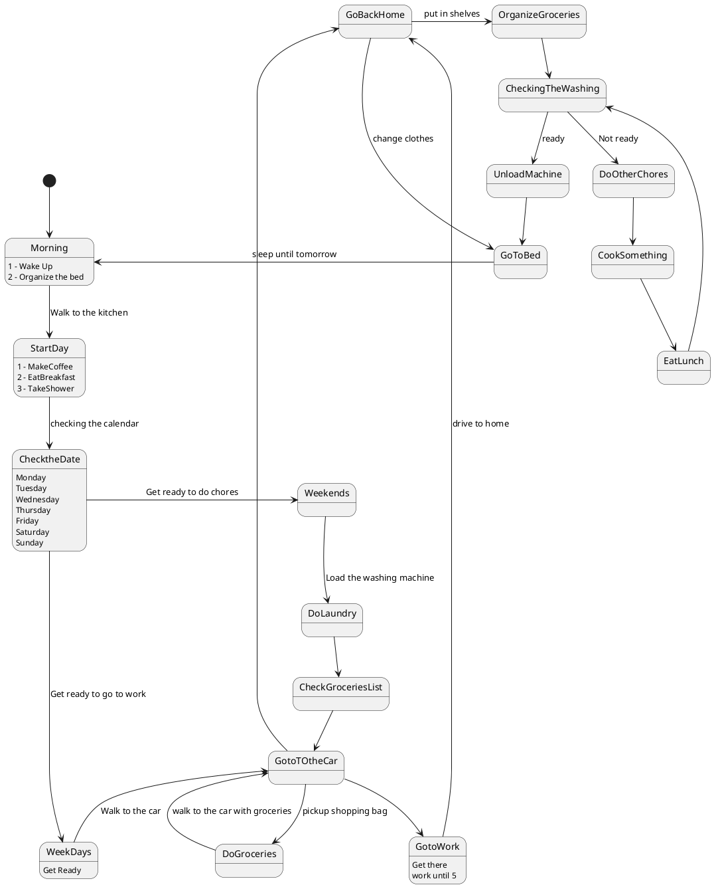

# Tasks

```plantuml
@startuml Tasks


[*] --> Morning
Morning : 1 - Wake Up
Morning : 2 - Organize the bed
Morning --> StartDay : Walk to the kitchen
StartDay : 1 - MakeCoffee
StartDay : 2 - EatBreakfast
StartDay : 3 - TakeShower
StartDay --> ChecktheDate : checking the calendar
ChecktheDate : Monday
ChecktheDate : Tuesday
ChecktheDate : Wednesday
ChecktheDate : Thursday
ChecktheDate : Friday
ChecktheDate : Saturday
ChecktheDate : Sunday
ChecktheDate -Left-> WeekDays : Get ready to go to work
ChecktheDate -Right-> Weekends : Get ready to do chores
WeekDays : Get Ready
WeekDays -up-> GotoTOtheCar : Walk to the car
GotoTOtheCar --> GotoWork
GotoWork : Get there
GotoWork : work until 5
GotoWork -up-> GoBackHome : drive to home
GoBackHome --> GoToBed : change clothes
GoToBed -right-> Morning : sleep until tomorrow
Weekends -down-> DoLaundry : Load the washing machine
DoLaundry --> CheckGroceriesList
CheckGroceriesList --> GotoTOtheCar
GotoTOtheCar --> DoGroceries : pickup shopping bag
DoGroceries --> GotoTOtheCar : walk to the car with groceries
GotoTOtheCar --> GoBackHome
GoBackHome -Right-> OrganizeGroceries : put in shelves
OrganizeGroceries --> CheckingTheWashing
CheckingTheWashing --> DoOtherChores : Not ready
CheckingTheWashing --> UnloadMachine : ready
DoOtherChores --> CookSomething
CookSomething -->EatLunch
EatLunch --> CheckingTheWashing
UnloadMachine -->GoToBed


@enduml
```

